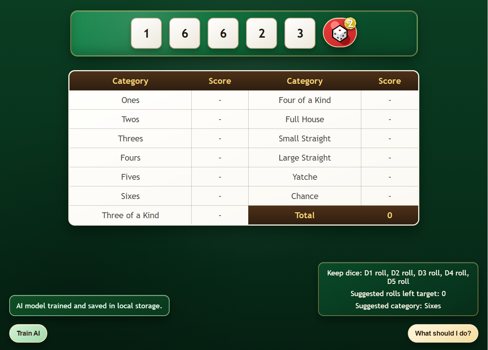

# 🎲 Yatche AI – Browser-Based Game with TensorFlow.js

A simple **Yatche (Yahtzee-style) dice game** built using only:

- HTML  
- CSS  
- Vanilla JavaScript  
- TensorFlow.js (running entirely inside the browser)

